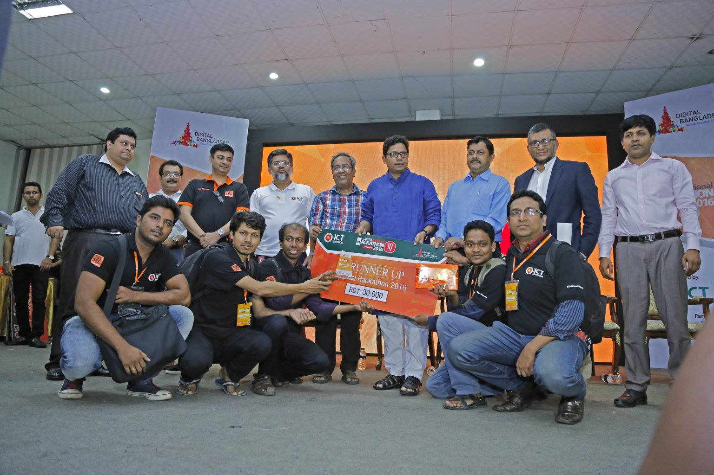

<!--markdown turorial-->  
</br>  
<h1>new line </h1>
kowshikdas<br>  

</br>  
<h1>liner niche dag </h1>
i am the student of cse <hr>
</br>  
<h1>italic text </h1>

_this is an italic tag_  

</br>  
<h1>bold tag </h1>

__this is__  

</br>  
<h1>delete text</h1>
<del>htis thi s fa a si  jaie jfamar aisonar bangla ami to abaloo f</del>  

</br>  
<h1>multiple line code block </h1>
`this is a good boy`  

</br>  
<h1>multiple line code block </h1>

```html
<html>
  <body>
    <h1>about</h1>
  </body>
</html>
```  
```css
<head>
  background-color: green;
</head>

```  

```javascript
console.log('hello world')
```  
</br>  
<h1>order list </h1>    

1.kowshik  
2.puja    
3.brinto  
</br>
<h1>unorder list </h1>  

- kow  
-  puja  
    - amin
- brinto  
</br>
<h1>task list </h1>  

- [x] task1  

- [x] task1  

- [x] task1  
  
</br>
<h1>link</h1>  

https://github.com/kowshikdas/life-story/commit/3a93854115aa3d46861ebd6e9ce1a614b8b03201  

</br>  
<h1>disable link</h1>
`https://github.com/kowshikdas/life-story/commit/3a93854115aa3d46861ebd6e9ce1a614b8b03201  `  

</br>  
<h1>markdown link syntex</h1>

[github tutorial][websitelink]  


<!--all link-->  
[websitelink]: https://www.youtube.com/watch?v=bl0-DTgh-mw&list=PLgH5QX0i9K3qAW8DT6I0XOxC23qnA4FL-&index=12  

</br>  
<h1>image syntex markedown</h1>  

  

</br>  
<h1>image syntex html</h1>  

   
❤️  


</br>  
<h1>table syntex</h1>  

| name |  email |  
|  -------  |   --------- |  
|  kowshik  |   k@gmial.com |  
|  puja  |   p@gmail.com|  


